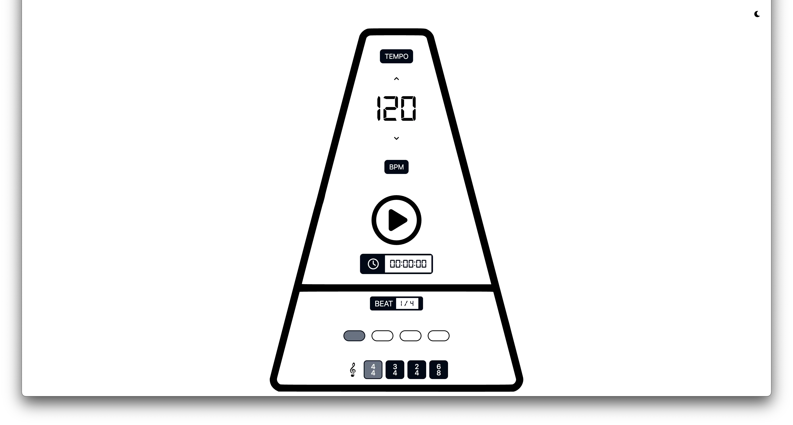
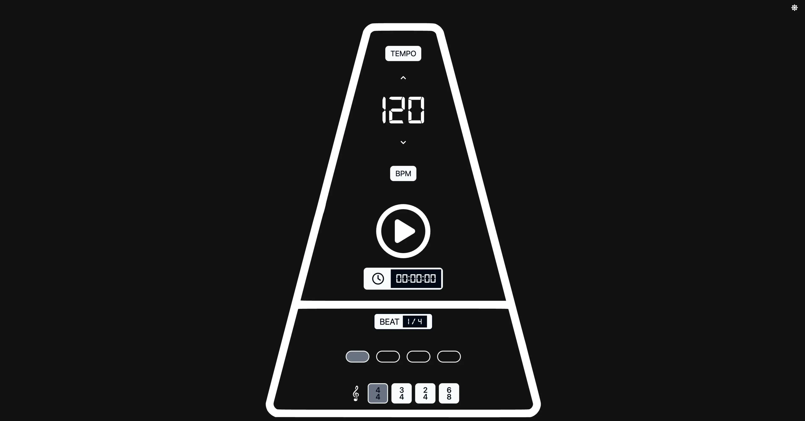

# 🎵 metronome_gg

> A fast, modern, and accessible metronome built with **Vite**, **React**, and **Tailwind CSS**.


---

## 📸 Demo

👉 **[Try it live here](https://metronome-gg.netlify.app/)**

---

## ✨ Features

- 🎛️ **Adjustable BPM & Time Signature**
- 🎵 **Audible Beats** — Click sounds
- 🟢 **Visual Beat Indicator** — Follows the tempo precisely
- 🌙 **Dark & Light Mode**
- 📱 **Fully Responsive** — Looks great on desktop & mobile
- ♿️ **Accessible** — ARIA labels, keyboard-friendly

---

## ⚙️ Tech Stack

- [Vite](https://vitejs.dev/) — Next-gen build tool
- [React](https://react.dev/) — Modern UI library
- [Tailwind CSS](https://tailwindcss.com/) — Utility-first styling
- [react-icons](https://react-icons.github.io/react-icons/) — Icon library
- [ESLint](https://eslint.org/) + [Prettier](https://prettier.io/) — Consistent code style

---

## 🖥️ Screenshots

| Light Mode                              | Dark Mode                             |
| --------------------------------------- | ------------------------------------- |
|  |  |

---

## 🚀 Getting Started

### 1️⃣ Clone the repo

```bash
git clone https://github.com/Chris-Z-85/metronome_gg.git
cd metronome_gg
```

### 2️⃣ Install dependencies

```bash
npm install
# or
pnpm install
```

### 3️⃣ Run locally

```bash
npm run dev
```

### 4️⃣ Build for production

```bash
npm run build
```

### 5️⃣ Preview production build

```bash
npm run preview
```

## Project Structure

- `src/` — Main source code
  - `components/` — UI components (Metronome, BpmPicker, ThemeToggle, etc.)
  - `hooks/` — Custom React hooks
  - `lib/` — Utility functions
  - `utils/` — Audio and other helpers
  - `App.tsx` — Main app component
  - `main.tsx` — Entry point
  - `index.css` — Base styles
- `public/` — Static assets
- `index.html` — HTML template

## ♿ Accessibility

Semantic HTML tags

Interactive elements have aria-labels

Icons with accessible descriptions or aria-hidden

Usable via keyboard

## 🗂️ TODO

✅ Basic metronome functionality

⏳ Add advanced time signature support

⏳ Save settings to local storage

⏳ Add user-configurable sound packs

Feel free to pick an open issue or submit your ideas!

## 🤝 Contributing

Contributions are welcome!

Fork the repo

Create a new branch (git checkout -b feature/my-feature)

Commit your changes

Push to your fork (git push origin feature/my-feature)

Open a Pull Request

See CONTRIBUTING.md for more details.

## 📃 License

This project is licensed under the MIT License — see LICENSE for details.

## 🙋‍♂️ Author

Chris Z
📧 chris.z@aol.com
🌐 https://chris-z.dev/
🐙 GitHub: Chris-Z-85

## ⭐️ Show Your Support

If you find this project helpful:

## ⭐️ Star this repo

🍴 Fork it

🗣️ Share it with fellow musicians!

## 📣 Feedback

Got feedback or feature requests?
Open an issue — I’d love to hear your ideas!
